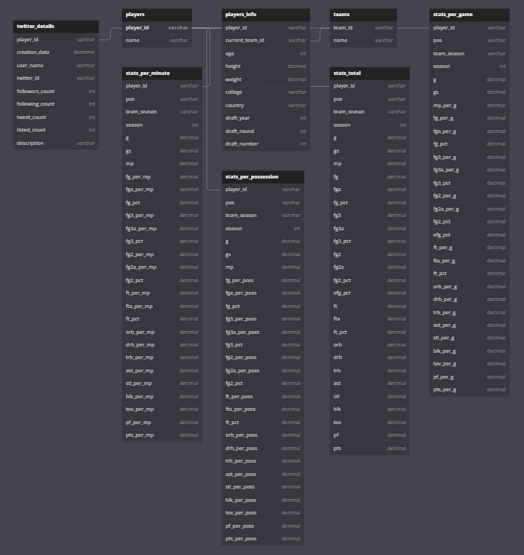

# ITC Data Mining Project
## _Nir David, Nissim Cohen_

Web scraping for NBA.

- Extract player stats per season and details.
- Save to CSV files.
- Inserts data to the database.
- Gets players' account data from Twitter API and inserts to the database.

## Motivation
- Scrape and analyse NBA data from the basketball-reference and NBA website.
- Get data from players on Twitter API.

## Build Status
- Project on third checkpoint.

## Features
- Extract player stats per season according to config.py.
- Save data from each season to CSV files.
- Save extracted data to MySQL database.
- Save data from Twitter to MySQL database.

## Database Structure

## How to Use?
- Make sure all the packages are installed according to the requirements.txt file.
- Define in the pvt_data_config.py the following variables: HOST, USER and PASSWORD of your MySQL database and TWITTER_BEARER_TOKEN.
- In order to get a Twitter Bearer Token, follow the instructions on https://developer.twitter.com/en/docs/twitter-api
- Download the Google Chrome Driver according to your Chrome version on the following website: https://chromedriver.chromium.org/downloads
- Save the Chrome Driver as 'chromedriver.exe' in the same folder as the codes.
- Run the file from the command line calling the code named 'generate_data.py', passing the starting year and the end year.
- This will save to your MySQL both the structure of the Database and insert both the scraped data and the data from Twitter API.

